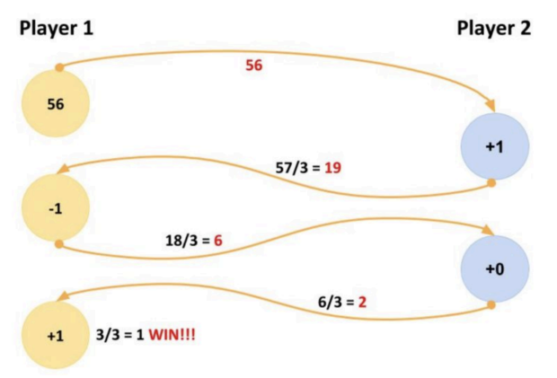

# Game of Three - Game Core

This project implements a two-player game using Spring Boot applications communicating with Kafka.

### Gameplay:

Two independent players (separate applications) take turns modifying a number.
Each player can add, subtract 1, or keep the current number then divide it by 3.
The goal is to reach the number 1 first.

#### Communication:

Players communicate their moves by sending messages to Kafka topics.
Each player listens for moves sent by the other player on a dedicated topic.

#### Project Structure:

* **[Shared Domain Model](https://github.com/AmjadKhader/Game-of-three.Game)**: A separate project contains the Game
  class, defining the game logic.

* **Player Applications**: Two Spring Boot applications represent each
  player ([Player1Application](https://github.com/AmjadKhader/Game-of-Three.Player1)
  and [Player2Application](https://github.com/AmjadKhader/Game-of-Three.Player2)). They use Kafka to send and receive
  moves from their designated topics.
